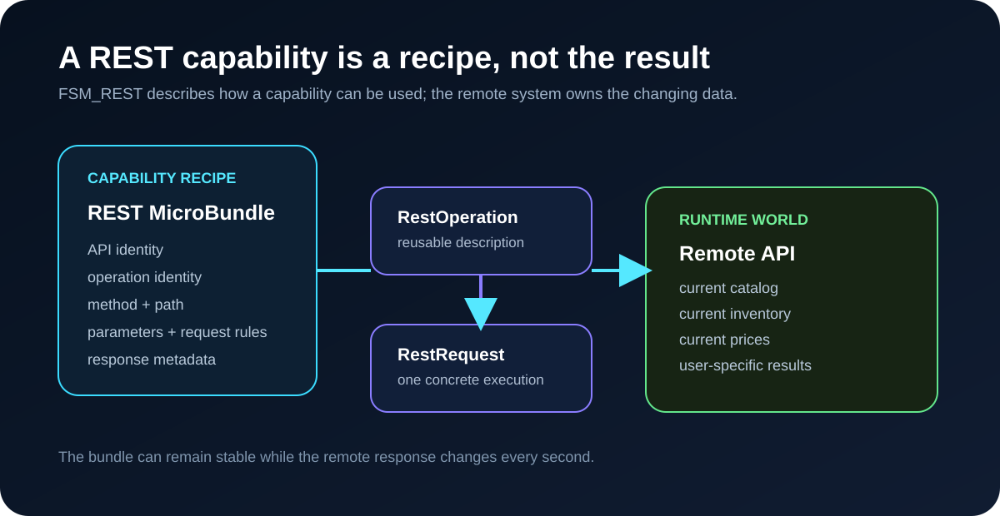
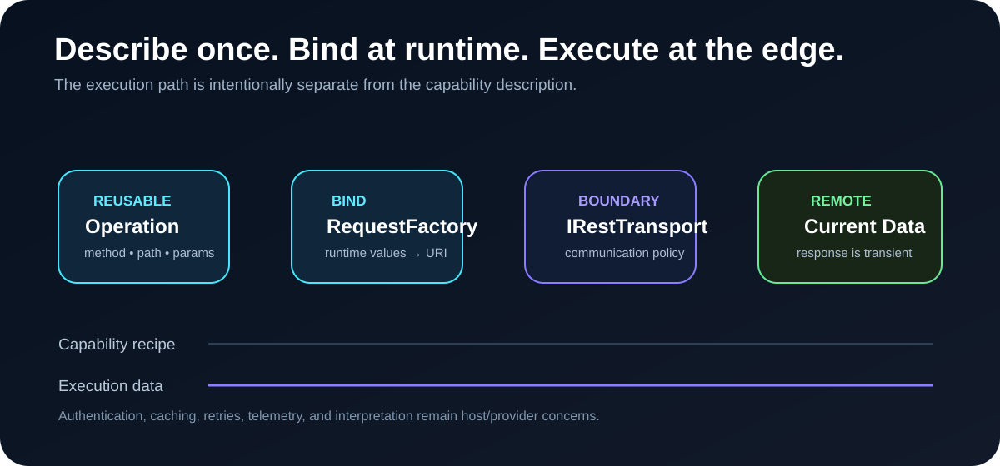
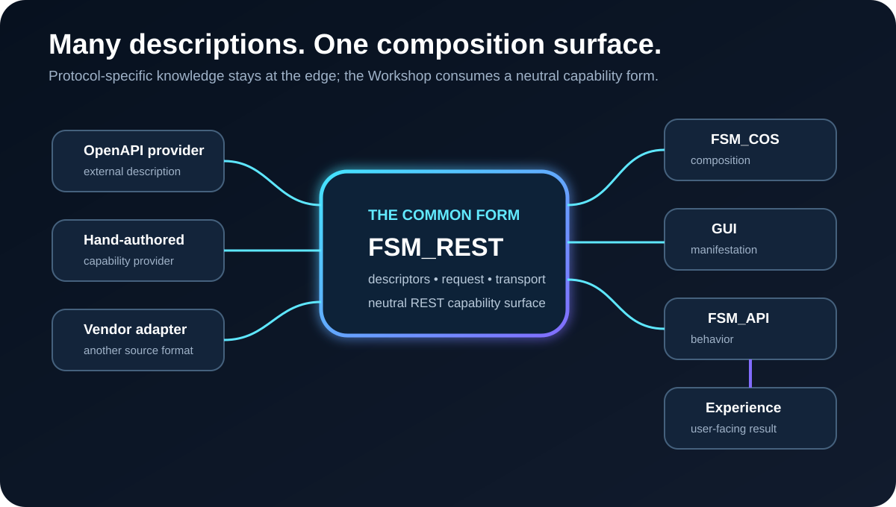

# TheSingularityWorkshop.FSM_REST

**REST capability and transport substrate for the FSM ecosystem.**

FSM_REST is intentionally **not an implementation of a REST API**, and it is not a container for every REST description format.

It provides the reusable forms from which REST capabilities can be composed:

~~~text
REST MicroBundle / external description
            |
            v
        FSM_REST
            |
     +------+------+
     |             |
 capability     transport
 descriptors    boundary
     |             |
     +------+------+
            |
            v
     GUI / FSM / Experience
~~~

The important architectural rule is:

> **FSM_REST provides the composition surface. Domain and protocol-specific MicroBundles provide the things composed through it.**

  

## If you only have a minute

FSM_REST answers one question:

> **How does a REST capability enter the Workshop without bringing its entire description format, GUI, domain, or transport policy with it?**

The answer is a small neutral vocabulary for capability description, request construction, and transport.

---

## The capability recipe

The useful trick is that a REST API can be enormous at runtime while being small as a capability description.

**The MicroBundle stores what is needed to obtain the capability—not the remote payload itself.**

~~~text
CAPABILITY RECIPE
      │
      ▼
RestOperationDescriptor
      │
      │ bind runtime values
      ▼
RestRequest
      │
      ▼
IRestTransport
      │
      ▼
REMOTE API
      │
      │ current / user-specific data
      ▼
RestResponse
      │
      ▼
GUI / FSM / Experience
~~~

For a storefront, the bundle can carry the API identity, operation identity, method, path, parameter definitions, request rules, response metadata, and provider-specific behavior.

The current catalog, inventory, prices, user-specific results, and other changing payloads remain runtime data.

| Capability recipe | Runtime result |
|---|---|
| method + path | current records |
| parameters | current prices |
| request rules | current inventory |
| response metadata | current response |
| provider behavior | transient transport data |

**The response is runtime data. The MicroBundle is the capability recipe.**

This means an endpoint can be cheap to describe, distribute, compose, and replace without copying the dataset it exposes.

## Build a capability

The smallest useful REST capability is just an operation description:

~~~csharp
var operation = new RestOperationDescriptor(
    "GET",
    "/products",
    "listProducts",
    "List products",
    "Returns the current product catalog.",
    [
        new RestParameterDescriptor(
            "page", "query", false, "integer", null, "Page number.")
    ],
    null,
    [
        new RestResponseDescriptor(
            "200", "Product collection.",
            ["application/json"], "array", null)
    ]);

var api = new RestApiDescriptor(
    "Store Catalog",
    "1.0",
    [operation]);
~~~

Nothing has been fetched, cached, or rendered.

You have described a capability that can now participate in the Workshop.

## Bind and execute the capability

When an experience needs the data, the reusable capability is first bound to runtime values:

~~~csharp
var binding = new RestOperationBinding(
    operation,
    new Dictionary<string, string?> { ["page"] = "1" });

var request = RestRequestFactory.Create(
    binding,
    new Uri("https://example.test"));
~~~

The binding is one invocation. The operation descriptor remains reusable.

When an experience needs to send that request:

~~~csharp
using var httpClient = new HttpClient();
IRestTransport transport = new HttpClientRestTransport(httpClient);

var request = new RestRequest(
    "GET",
    new Uri("https://example.test/products?page=1"));

RestResponse response = await transport.SendAsync(request);

if (response.IsSuccessStatusCode)
{
    Console.WriteLine(response.Body);
}
~~~

The transport communicates.

It does not decide what the response means. Interpretation remains downstream.

  

## REST endpoint → MicroBundle

A provider can translate an external description into the neutral FSM_REST vocabulary and carry that capability as MicroBundle data.

~~~text
external description
        │
        ▼
provider / adapter
        │
        ▼
RestApiDescriptor
        │
   ┌────┼────┐
   ▼    ▼    ▼
 op A  op B  op C
   └────┼────┘
        ▼
 REST MicroBundle
        │
        ▼
    FSM_COS / host
        │
   ┌────┴────┐
   ▼         ▼
  GUI       FSM
   └────┬────┘
        ▼
    Experience
~~~

The source could be OpenAPI, a hand-authored definition, or another provider.

**FSM_REST does not need to know which.**

When the REST capability itself needs to participate in FSM_COS, that integration lives in the separate `TheSingularityWorkshop.FSM_Rest.COS` package. The transport substrate remains independent.

  

See [REST Capability Model](docs/REFLECTION.md), [REST MicroBundles](docs/MICROBUNDLE.md), and [Theory](docs/THEORY.md).

## Why the response is not the bundle

The response is transient, changing, and often user-specific.

The bundle is reusable capability data.

~~~text
SMALL DESCRIPTION
      │
      │ method / path / parameters /
      │ request rules / response metadata
      ▼
REMOTE CAPABILITY
      │
      │ current state
      ▼
LARGE / DYNAMIC RESULT
~~~

This does not claim every REST integration is physically small. It means the bundle does not need to duplicate the remote dataset merely to describe how that dataset can be obtained.

That is the property that makes REST capabilities especially attractive as MicroBundle content.

## Transport boundary

Before transport, RestRequestFactory can bind operation parameters into a concrete request:

~~~csharp
var request = RestRequestFactory.Create(
    operation,
    new Uri("https://example.test/api"),
    new Dictionary<string, string?>
    {
        ["id"] = "42",
        ["page"] = "1"
    });
~~~

It handles path, query, header, and cookie parameter locations while leaving authentication, retries, caching, and transport policy outside the core.

The package provides a minimal executable boundary:

~~~csharp
var request = new RestRequest(
    "POST",
    new Uri("https://example.test/users"),
    new Dictionary<string, string>
    {
        ["X-Trace"] = "trace-123"
    },
    "{\"name\":\"Ada\"}");

IRestTransport transport = new HttpClientRestTransport(httpClient);

RestResponse response = await transport.SendAsync(request);
~~~

IRestTransport is the important boundary. HttpClientRestTransport is merely one adapter.

That means a host can replace the HTTP implementation without changing the capability model.

## The operational theater

The intended direction is larger than an API client:

~~~text
external capability
        |
        v
MicroBundle / provider
        |
        v
   REST capability
        |
        +----------------+
        |                |
        v                v
      GUI              FSM behavior
        |                |
        +-------+--------+
                |
                v
           Experience
~~~

A REST operation might ultimately manifest as a button, form, table action, workflow node, FSM transition, automated behavior, or another composition primitive.

FSM_REST does not choose the manifestation.

## Relationship to the ecosystem

| Project | Responsibility |
|---|---|
| FSM_API | state-machine execution |
| MicroBundleDomain | domain-side MicroBundle description |
| FSM_COS | runtime MicroBundle composition |
| FSM_REST | REST capability and transport substrate |
| FSM_Rest.COS | optional REST-to-FSM_COS MicroBundle integration |
| FSM_Serialization | serialized representation |
| GUI | visual manifestation |

Concrete protocol/domain packages remain separately owned and publishable. FSM_REST can also provide the small adapter needed when the REST capability itself is the MicroBundle.

## Alpha 4 boundary

**TheSingularityWorkshop.FSM_Rest 0.1.0-alpha.4**

Alpha 4 makes the documented capability model directly composable: runtime operation values are separated from reusable operation descriptors. The optional REST MicroBundle adapter is now isolated in `TheSingularityWorkshop.FSM_Rest.COS`, so the core REST package does not depend on FSM_COS.

The current package intentionally does **not** include:

- OpenAPI parsing;
- OpenAPI $ref resolution;
- YAML parsing;
- authentication implementations;
- URL discovery;
- GUI generation;
- concrete REST services;
- domain-specific MicroBundles.

Those are composition opportunities for separate packages.

## Development

~~~bash
dotnet restore TheSingularityWorkshop.FSM_REST.slnx
dotnet build TheSingularityWorkshop.FSM_REST.slnx --configuration Release
dotnet test tests/FSM_REST.Tests/FSM_REST.Tests.csproj --configuration Release
dotnet pack src/FSM_REST/FSM_REST.csproj --configuration Release --output ./artifacts
~~~

## License

MIT. See LICENSE.txt.

---

## 🔗 Resources & Support

### 📦 Get FSM_API

- **Unity Asset Store:** [FSM_API for Unity](https://assetstore.unity.com/packages/slug/332450)
- **Core NuGet:** [TheSingularityWorkshop.FSM_API](https://www.nuget.org/packages/TheSingularityWorkshop.FSM_API)
- **This Package:** [TheSingularityWorkshop.FSM_Rest](https://www.nuget.org/packages/TheSingularityWorkshop.FSM_Rest)
- **Source Code:** [TheSingularityWorkshop.FSM_REST on GitHub](https://github.com/TrentBest/TheSingularityWorkshop.FSM_REST)

### 💖 Support The Singularity Workshop

- **Patreon:** [Support us on Patreon](https://www.patreon.com/c/TheSingularityWorkshop)
- **PayPal:** [Make a donation](https://www.paypal.com/donate/?hosted_button_id=3Z7263LCQMV9J)

  

  <em>The Singularity Workshop — Tools for the curious, the bold, and the systemically inclined.</em> 
  <strong>Because state shouldn't be a mess.</strong>

